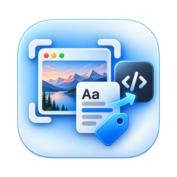
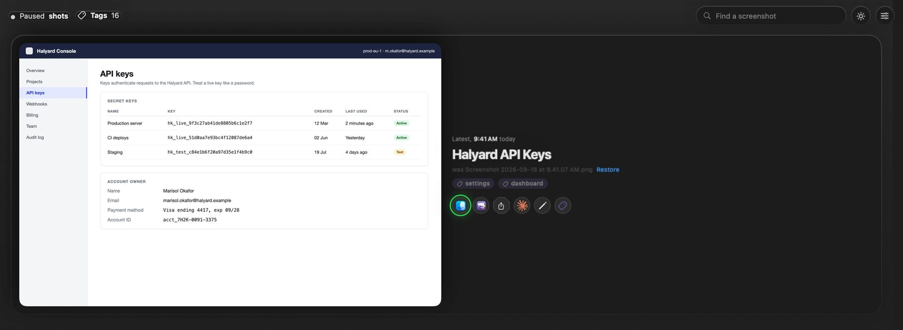
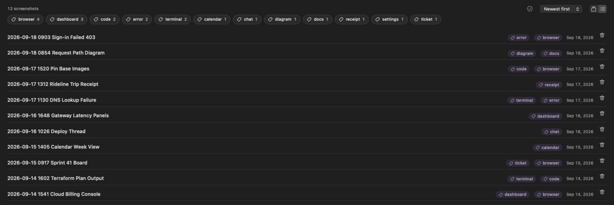
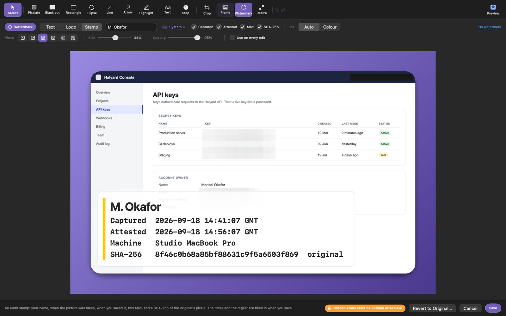

<div align="center">



# ShotScribe: the screenshot renamer for macOS

**Every Mac screenshot, named the moment it lands, by the AI you already use, and it stays a file in your folder.**

<br />

[](https://josh-vanorden.github.io/shotscribe/)
&nbsp;&nbsp;
[](https://github.com/josh-vanorden/shotscribe/stargazers)

<br />

[](https://github.com/josh-vanorden/shotscribe/releases/latest)
&nbsp;
[](#install)
&nbsp;
[](#what-it-touches)
&nbsp;
[](LICENSE)

---

Your screenshot folder is a wall of `Screenshot 2026-09-18 at 9.41.07 AM.png`. ShotScribe reads each new capture on your Mac, asks your own assistant for a two or three word title, and renames the file with the date first. The folder becomes readable, and you can search what each screenshot said, which matters more a month later than any title.

[Website](https://josh-vanorden.github.io/shotscribe/) | [Install](#install) | [How it works](#how-screenshot-renaming-works) | [Features](#features) | [Whose AI?](#whose-ai-is-it) | [MCP server](#mcp-server-and-the-screenshot-skill) | [What it touches](#what-it-touches)

</div>



## A folder nobody can read

macOS names every capture after the second it was taken. A month later you remember a billing console and a DNS error. The filenames remember `3.41.07 PM`. You open twelve files to find one.

Renaming by hand works for about a day.

## Before and after

| macOS gave you | ShotScribe left you |
|---|---|
| `Screenshot 2026-09-14 at 3.41.07 PM.png` | `2026-09-14 1541 Cloud Billing Console.png` |
| `Screenshot 2026-09-17 at 11.30.52 AM.png` | `2026-09-17 1130 DNS Lookup Failure.png` |
| `Screenshot 2026-09-18 at 9.03.19 AM.png` | `2026-09-18 0903 Sign-in Failed 403.png` |
| `Screen Recording 2026-09-16 at 10.26.44 AM.mov` | `2026-09-16 1026 Deploy Thread.mov` |

Date first, so sorting by name stays chronological. A file you named yourself is never touched.



## Install

**The app.** Download `ShotScribe-<version>.dmg` from the [latest release](https://github.com/josh-vanorden/shotscribe/releases/latest), open it, and drag ShotScribe to Applications. It is Developer ID signed, notarized and stapled, so macOS 13 and later open it without a warning. <!--release-fact-->It runs on Apple silicon and Intel Macs: the release is a universal build.<!--/release-fact-->

**The CLI and the MCP server.** They build from source in under a minute, with nothing beyond Xcode's toolchain:

```bash
git clone https://github.com/josh-vanorden/shotscribe.git && cd shotscribe
swift build -c release
cp .build/release/shotscribe /usr/local/bin/
```

Try it without renaming anything:

```bash
shotscribe rename --dry-run "~/Desktop/Screenshot 2026-09-18 at 9.41.07 AM.png"
```

## How screenshot renaming works

```
  ⌘⇧4                                                        your folder
   │                                                              ▲
   ▼                                                              │
┌────────────┐   ┌──────────────────┐   ┌───────────────┐   ┌─────┴──────────┐
│ new capture│──▶│ Apple Vision OCR │──▶│  your titler  │──▶│ rename + tag   │
│ lands      │   │ on this Mac      │   │ 2–3 words     │   │ + index        │
└────────────┘   └──────────────────┘   └───────────────┘   └────────────────┘
                  pixels never leave      text only, and       date first,
                  the machine             only if you say so   file stays put
```

1. **Watch.** New captures are picked up from your macOS screenshot folder. Screen recordings land there too, and it names those from a couple of frames.
2. **Read.** Apple's on-device Vision OCR pulls the text out of the capture. The picture never leaves your Mac.
3. **Title.** The text goes to the titler you picked: Claude Code, Codex, Gemini CLI, Cursor, Ollama, an endpoint, or the offline keyword titler.
4. **File.** The capture is renamed from a template you control, gets up to two Finder tags from a list you control, and its text goes into a local search index.

## Features

| | What you get |
|---|---|
| **Auto-rename** | Captures are named as they land. Only macOS default names are touched, in any language. |
| **Your own AI** | No API keys shipped, no account. It drives the assistant you are already signed in to. |
| **Works offline** | Pick Ollama or the keyword titler and nothing leaves the machine. |
| **Finder tags** | Up to two per capture from a fixed list, so Finder and Spotlight can filter without ShotScribe running. |
| **Search what it said** | `shotscribe find "NXDOMAIN"` searches the text on the screenshot, because a three-word title is a thin hook. |
| **A built-in editor** | Pixelate, black out, arrows, step numbers, frames, crop, resize, and a watermark. |
| **Audit stamp** | A signature block with your name, capture time, save time, the Mac, and a SHA-256 of the original pixels. |
| **MCP server** | Four tools over stdio, so Claude Code, Cursor, Codex or Gemini CLI can name and read screenshots mid-session. |
| **Rebuild as code** | Hands your assistant the screenshot's text with its layout, so a capture becomes a diff in your project. |
| **Scored titles** | `shotscribe eval` re-titles the captures you already kept and reports recall and precision. A prompt change gets a number instead of a feeling. |



## Whose AI is it?

**Yours.** The AI tab names who titles a capture. The app, the CLI and the watcher all honour the same choice.

| Titler | What it drives | Where the text goes |
|---|---|---|
| **Claude Code** (default) | the `claude` CLI you are signed in to, tools disabled | Anthropic, on your subscription |
| **Codex** | `codex exec` in a read-only sandbox | OpenAI, on your login |
| **Gemini CLI** | `gemini -p`, sandboxed | Google, on your login |
| **Cursor Agent** | `cursor-agent -p` | Cursor, on your login |
| **Ollama** | `ollama run <model>` | nowhere, the model runs on this Mac |
| **An endpoint** | any OpenAI-compatible `/chat/completions` | the endpoint you name |
| **Other CLI** | `llm`, `aichat`, `mods`, a team script | wherever it sends it |
| **Offline** | the keyword titler | nowhere |

Every preset ships with the flags that stop the tool from *acting* on the text, because what is on your screen is not always text you wrote. An endpoint key lives in your Keychain. **Try it on the newest capture** shows the title a choice would give without renaming anything.

The presets, the `{prompt}` contract and what happens with nothing installed: [docs/titlers.md](docs/titlers.md)

## MCP server and the /screenshot skill

`shotscribe-mcp` exposes the same engine as tools. When the caller is already a model, the server stays mechanical: it never calls a model itself and has no network listener.

```bash
claude mcp add shotscribe -- /path/to/shotscribe-mcp     # Claude Code
codex mcp add shotscribe -- /path/to/shotscribe-mcp      # Codex CLI
gemini mcp add shotscribe /path/to/shotscribe-mcp        # Gemini CLI
```

Then, mid-session: *"grab my latest screenshot and give it a proper name."*

The [`/screenshot` skill](skills/screenshot/SKILL.md) turns that into one word for Claude Code. `/screenshot code` rebuilds the capture as code in the project you are standing in.

Full tool reference: [docs/mcp.md](docs/mcp.md)

## What it touches

ShotScribe is a small tool with a sharp edge: it renames files. Read this once.

- **It renames only macOS default capture names.** Anything you named yourself is left alone unless you pass `--force`.
- **Auto-rename is on by default.** Launching an app whose one job is renaming screenshots is the opt-in. The switch is on the Rename tab.
- **It keeps a search index at `~/.shotscribe/index.json`**, readable by your user only. Treat it like the screenshots it describes.
- **The only network code is the endpoint titler**, and it runs only when you choose an endpoint. There is no telemetry.
- **Removing it takes five lines.** Renamed files keep their names and tags. Nothing else is left behind.

The long version: [docs/privacy.md](docs/privacy.md) | [docs/uninstall.md](docs/uninstall.md) | [SECURITY.md](SECURITY.md)

## Documentation

| Guide | What is in it |
|---|---|
| [Whose AI is it?](docs/titlers.md) | Every titler, the editable CLI presets, where the text goes |
| [CLI reference](docs/cli.md) | `label`, `rename`, `watch`, `find`, `index`, `eval`, `ai`, and every flag |
| [Naming and tags](docs/naming.md) | The `{date} {time} {title} {app}` template and the tag vocabulary |
| [MCP server](docs/mcp.md) | The four tools, client setup for Cursor and LibreChat, the `/screenshot` skill |
| [Menu bar app](docs/app.md) | The menu, the Library's five inspector tabs, the editor, Dock or menu bar |
| [Hosting the pane](docs/hosting.md) | `ShotScribeUI` as a library: mount the surface in your own app in twenty lines |
| [Privacy](docs/privacy.md) | What is kept on the machine, where, and what it contains |
| [Known limitations](docs/limitations.md) | What is tested end to end and what is shipped as documented |

## Why this exists

Extracted from a larger app ("Navi") as its own tool, on the theory that a
handful of small, sharp, open-source tools beats one monolith — each easy to
understand, iterate, and hand to Claude as a capability.

Next up is a WidgetKit widget: a one-tap App Intent front door. Everything that has shipped is in the [CHANGELOG](CHANGELOG.md).

## Contributing

Issues and pull requests are welcome. The engine lives in `ShotScribeCore`, which backs the CLI, the MCP server and the app, so most fixes land in one place. Run `swift test` before you open a PR. The rules a pull request has to respect are in [CONTRIBUTING.md](CONTRIBUTING.md).

## License

MIT. See [LICENSE](LICENSE).

---

<div align="center">

Built by [Josh VanOrden](https://github.com/josh-vanorden) | [josh-vanorden.github.io/shotscribe](https://josh-vanorden.github.io/shotscribe/) | [LinkedIn](https://www.linkedin.com/in/joshua-vanorden)

<br />

**If ShotScribe made your screenshot folder readable:**

[](https://github.com/josh-vanorden/shotscribe/stargazers)
&nbsp;&nbsp;
[](https://www.linkedin.com/in/joshua-vanorden)

</div>
